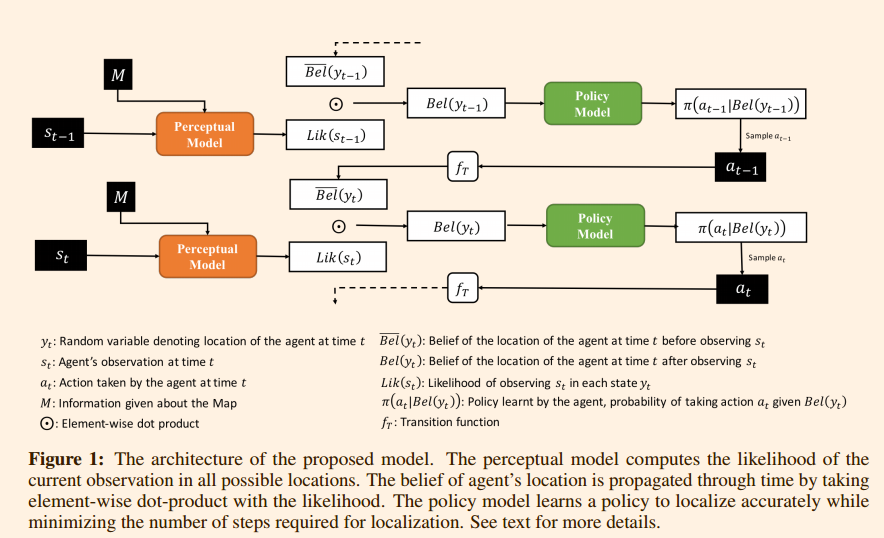
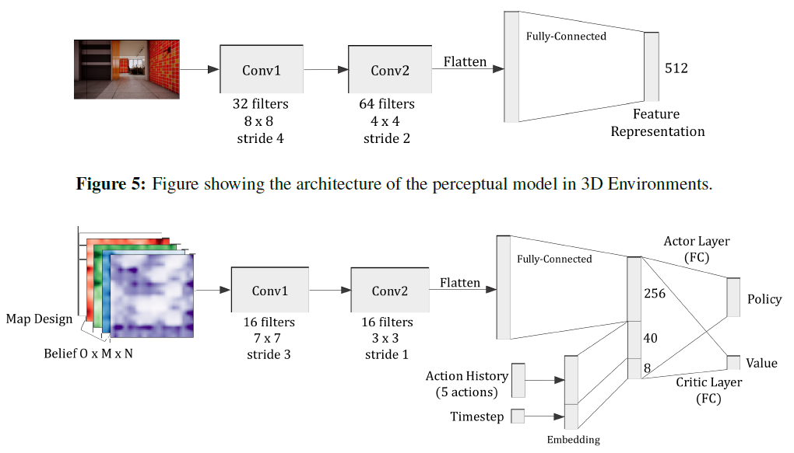
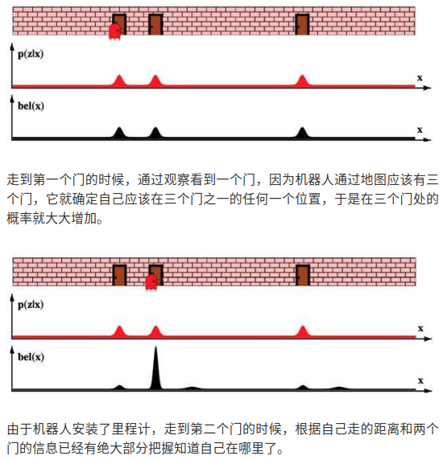
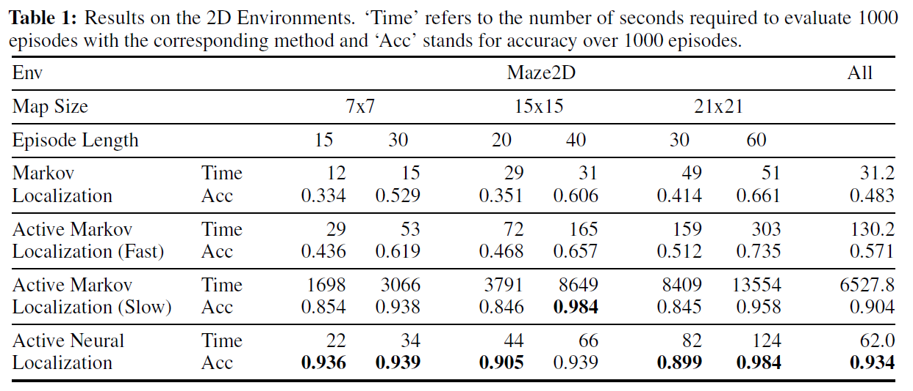
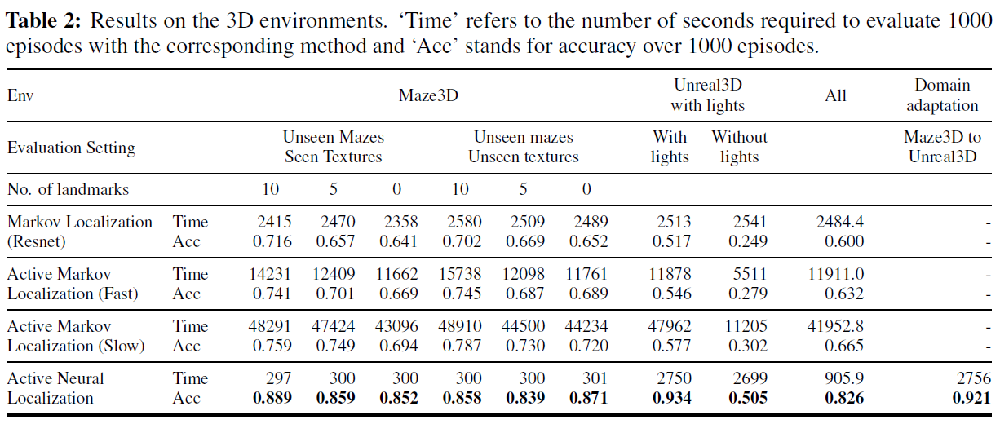
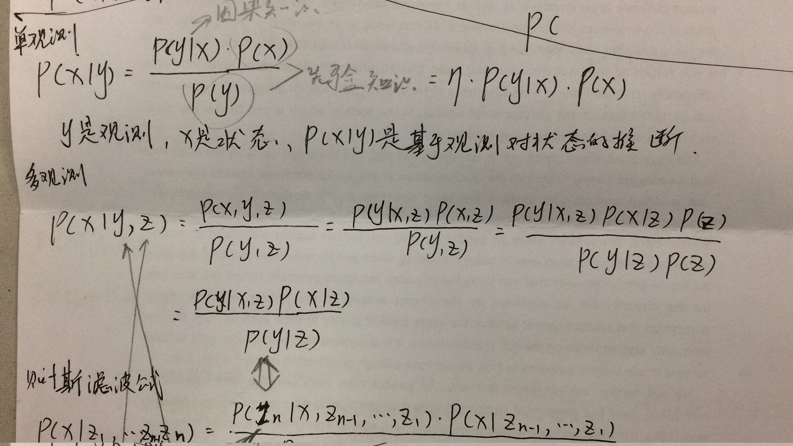
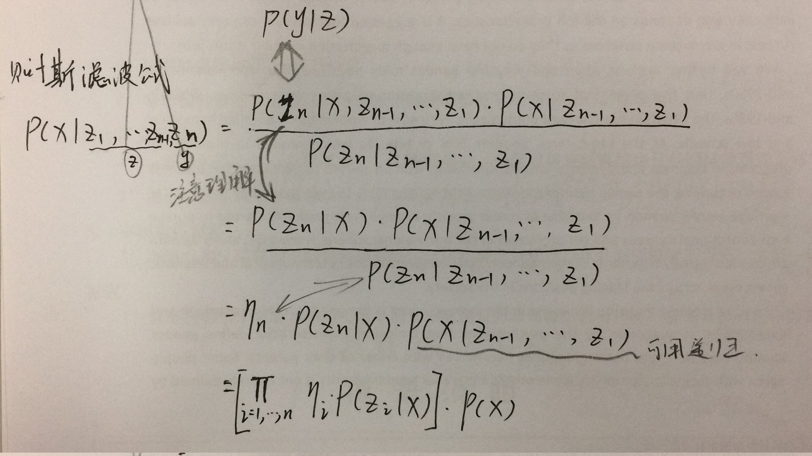
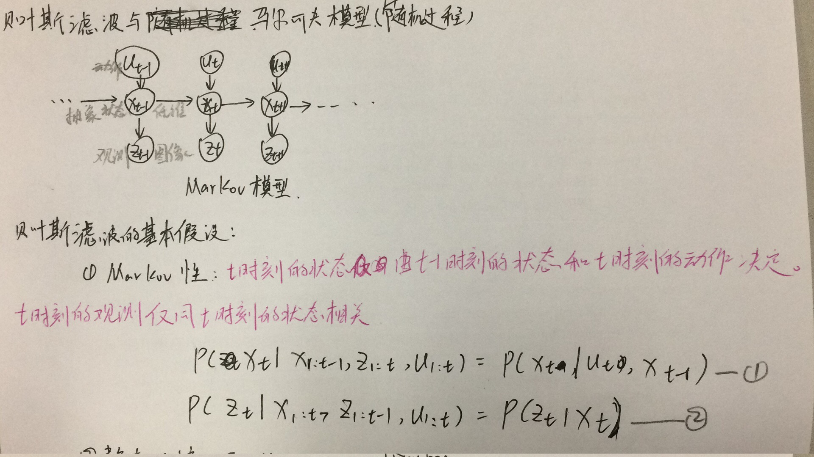
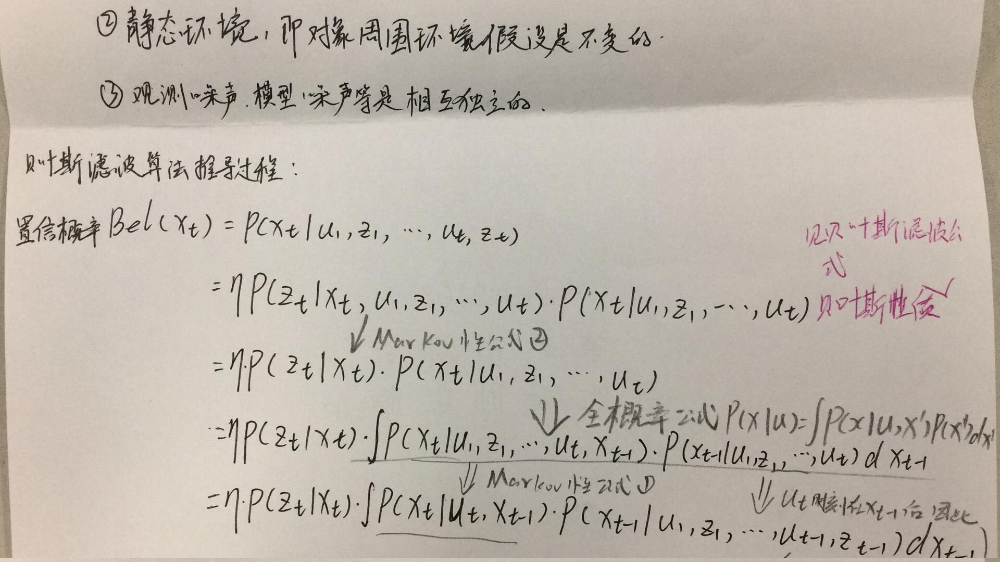
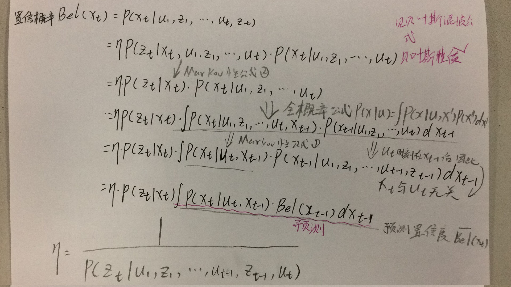

# Self-location in 2D maze with TensorFlow

This repository is to repeat article "active neural location" with tensorflow in 2Dmaze. This repository is based on the author's code with pytorch.

- 定义问题:
  已知地图M，但位置未知，通过主动观察环境，实现定位。

**文章基于概率机器人导航经典算法--贝叶斯滤波器利用A3C框架作为policy model决策，旨在通过主动观察，即通过动作主动指导机器人主动观察环境从而解决全局定位问题。**

- 之前各种流派和解决方法
  [Bayes filtering](https://www.cnblogs.com/ycwang16/p/5995702.html?utm_source=itdadao&utm_medium=referral)、[kalman filtering](https://www.cnblogs.com/ycwang16/p/5999034.html)、扩展kalman滤波、信息滤波、粒子滤波。

- 算法

  ->算法框架

整个框架由perceptual model, policy model and transition function三个模块组成。

perceptual model通过测量值在地图信息M中找到，符合测量特征st的置信概率分布Like(st)。在Maze2D中通过测量深度，在地图中找到相同深度的位置和方向。在3D环境中通过拍摄图像(**如何从图像到*Like(st)*还需要讨论？**)

policy model通过A3C实现，注意这一Belief（OxMxN）是因为在pytorch下实现，在tensorflow中应该是（MXNXO），经过第一个全连接层后与历史信息拼接。（**注意这里对历史信息Action History和Timestep的理解？**）

  ->数学定义

本文基于贝叶斯滤波器算法实现，整个算法的数学公式如下：
$$
\overline{bel}(s_{t+1})=\int_{s_{t}}P(s_{t+1}|s_{t})bel(s_{t})\\
bel(s_{t+1})=\eta P(observation_{t+1}|s_{t+1})\overline{bel}(s_{t+1})
$$
  

->框架中每个部分数学公式

1. perceptual model

   calculate P(observation|s)  through [cosine similarity](https://en.wikipedia.org/wiki/Cosine_similarity) （**怎么实现的？？？**）

$$
P(observation_{t+1}|s_{t+1})=
$$

1. policy model

   使用不加LSTM的A3C框架即可实现，其中拼接了**Action History和Timeste**（**这两个信息具体所指？？**）

2. transition model

   [egomotion model](https://arxiv.org/pdf/1702.03920.pdf) 用于agent在action后，belief_map应该随之改变。例如在t时刻agent面向东，agent向前动作后，t+1时刻的位置应该在t时刻的右边一个单位。因此belief_map应该随之向右平移一个单位，即t时刻可能的位置在action后也随之移动。

- 实验

  ->与最新方法比较

  ->不同参数设置下的不同情况

- 这篇文章有什么套路，总结浓缩

  使用深度强化学习实现传统导航模型中的causal knowledge。！！！！

- 问题与错误（假设条件、计算复杂度）

  假设基础：

  1. 静止环境
  2. 离散方向（仅四个方向）

- 自己对文章的想法

  1. 多目标导航
  2. 连续方向（360度）
  3. 部分可观察环境（+建2维图）

- 参考资料

[Neural-Location-github](https://github.com/devendrachaplot/Neural-Localization)

[video-doom](https://www.youtube.com/watch?v=rdhKu8GqVLw)

[video-unreal](https://www.youtube.com/watch?v=T5Ezx-_QfU0)

- 附录

